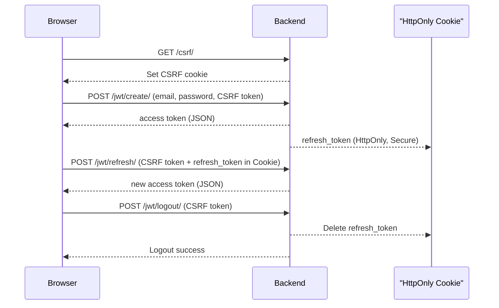

# Forum Project Stage CC WebAPI Documentation

This document describes the available endpoints, request formats, response structures, and validation rules for the *
*Forum Project Stage CC WebAPI**.  
It is organized by module to allow each developer to maintain and extend their respective sections.

---

## Authentication

All endpoints require JWT authentication.  
Include the token in the `Authorization` header using the following format:

Authorization: Bearer <your_access_token>

---

## Auth API

### Endpoints

#### 1. CSRF Init

- `GET /api/v1/auth/csrf/`
  Initializes CSRF protection by setting a CSRF cookie.
  This endpoint must be called by the frontend before sending any POST/PUT/PATCH/DELETE requests.

### Request Example

```json
{
  "detail": "CSRF cookie set"
}
```

#### 2. JWT Create (Login)

- `POST /api/v1/auth/jwt/create/`
  Authenticates a user. Returns an access token in the response body and stores the refresh token in an HttpOnly cookie.

### Request Example

- POST /api/v1/auth/jwt/create/
- Content-Type: application/json
- X-CSRFToken: <csrf_token>

```json
{
  "email": "user@example.com",
  "password": "strong_password"
}
```

### Example Response

```json
{
  "access": "<your_access_token>"
}
```

(the refresh token is stored in the refresh_token HttpOnly cookie)

#### 3. JWT Refresh

- `POST /api/v1/auth/jwt/refresh/`
  Generates a new access token using the refresh token stored in the HttpOnly cookie.

### Request Example

- POST /api/v1/auth/jwt/refresh/
- Content-Type: application/json
- X-CSRFToken: <csrf_token>

### Example Response

```json
{
  "access": "<your_new_access_token>"
}
```

#### 4. JWT Logout

- `POST /api/v1/auth/jwt/logout/`
  Invalidates the refresh token and clears the authentication cookie.

### Request Example

- POST /api/v1/auth/jwt/logout/
- Content-Type: application/json
- X-CSRFToken: <csrf_token>

### Example Response

```json
{
  "detail": "Successfully logged out"
}
```

### Authentication Flow



## Startup API

### Endpoints

- `GET /api/profiles/startups/` — Retrieve a list of all startup profiles
- `POST /api/profiles/startups/` — Create a new startup profile
- `GET /api/profiles/startups/{id}/` — Retrieve details of a specific startup profile
- `PATCH /api/profiles/startups/{id}/` — Update an existing startup profile
- `DELETE /api/profiles/startups/{id}/` — Delete a startup profile

## Investor API

### Endpoints

- `GET /api/profiles/investors/` — Retrieve a list of all investors
- `POST /api/profiles/investors/` — Create a new investor  
  ...

### Request Example: Create Startup Profile

```json
{
  "company_name": "GreenTech",
  "description": "Eco-friendly solutions",
  "website": "https://greentech.ua",
  "startup_logo": null
}
```

### Response Example: Created Startup Profile (201 Created)

```json
{
  "id": 1,
  "company_name": "GreenTech",
  "description": "Eco-friendly solutions",
  "website": "https://greentech.ua",
  "startup_logo": null,
  "projects": [],
  "created_at": "2025-08-05T00:00:00Z",
  "updated_at": "2025-08-05T00:00:00Z"
}
```

---

## Project API

### Endpoints

- `GET /api/projects/` — Retrieve a list of all projects
- `POST /api/projects/` — Create a new project
- `GET /api/projects/{id}/` — Retrieve details of a specific project
- `PATCH /api/projects/{id}/` — Update an existing project
- `DELETE /api/projects/{id}/` — Delete a project

---

### Request Example: Create Project

```json
{
  "startup": 1,
  "title": "AI Platform",
  "description": "Smart analytics for business",
  "status": "draft",
  "duration": 30,
  "funding_goal": "100000.00",
  "current_funding": "5000.00",
  "category": 2,
  "email": "project@example.com",
  "has_patents": true,
  "is_participant": false,
  "is_active": true
}
```

### Response Example: Created Project (201 Created)

```json
{
  "id": 1,
  "startup": 1,
  "title": "AI Platform",
  "description": "Smart analytics for business",
  "status": "draft",
  "duration": 30,
  "funding_goal": "100000.00",
  "current_funding": "5000.00",
  "category": 2,
  "email": "project@example.com",
  "has_patents": true,
  "is_participant": false,
  "is_active": true,
  "created_at": "2025-08-05T00:00:00Z",
  "updated_at": "2025-08-05T00:00:00Z"
}
```

---

## Validation Rules

### Startup Profile

- company_name: required, unique
- description: required
- website: optional
- startup_logo: optional

### Project

- startup: required (must reference existing profile)
- title: required
- funding_goal: required if is_participant is true
- current_funding: must not exceed funding_goal
- business_plan: required if status is completed
- email: required, must be valid

---

## Token Refresh

Use `/api/token/refresh/` to obtain a new access token.

### Response Example

```json
{
  "refresh": "<your_refresh_token>",
  "access": "<your_new_access_token>"
}
```

# OAuth Authentication API Documentation

## Part 1

## Overview

This document describes the OAuth authentication endpoints for Google and GitHub integration.

---

## POST api/v1/auth/oauth/login/

### Description

Authenticate users using Google or GitHub OAuth providers. The endpoint exchanges OAuth provider tokens for application
JWT tokens and returns user information.

## Request

- **Headers:**  
  `Content-Type: application/json`

- **Body:**
  ```json
  {
    "provider": "google" | "github",
    "token": "<OAuth token>"
  }
  ```
    - **Response**
  ```json
  {
    "access": "jwt_access_token",
    "user": {
      "id": "user_123",
      "email": "user@example.com",
      "first_name": "John",
      "last_name": "Doe",
      "user_phone": "",
      "title": "",
      "role": "user"
    }
  }
  ```

**Status codes:**

|    Status Code    |                 Description                  |
|-------------------|----------------------------------------------|
| `400 Bad Request` | Invalid request parameters or malformed data |
| `403 Forbidden`   | Authenticated but insufficient permissions   |

## Part 2

## Callback URLs

The OAuth callback URLs are configured to handle redirects after successful authentication with the OAuth provider.
These URLs are used by the frontend to receive authorization codes or tokens.

### Configured Callback URLs

- **Production**: ----
- **Development**: `http://127.0.0.1:8000/oauth/callback/`

## Usage Instructions

1. **Initiate OAuth Flow**:
    - Redirect users to the OAuth provider's authorization endpoint (e.g., `https://provider.com/oauth/authorize`).
    - Include the appropriate `redirect_uri` parameter matching one of the configured callback URLs

2. **Handle Callback**:
    - After authentication, the OAuth provider will redirect the user to the specified callback URL with an
      authorization code or token in the query parameters (e.g., `https://yourapp.com/auth/callback?code=abc123`).
    - The frontend should extract the `code` from the URL query parameters using `URLSearchParams`.

3. **Extracting Query Parameters**:
    - Example of JavaScript to extract parameters from the callback URL:
      ```javascript
      const urlParams = new URLSearchParams(window.location.search);
      const code = urlParams.get('code');
      const state = urlParams.get('state');
      const error = urlParams.get('error');
      ```

4. **ExchangeCode for Token**:
  -Send the authorization code to your backend API `/users/oauth/login/` to exchange it for an access token.
