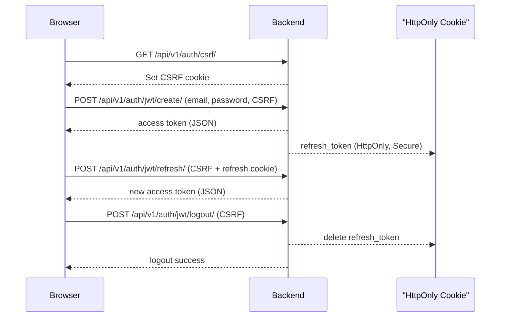

# Forum Project Stage CC WebAPI Documentation

This document describes the available endpoints, request formats, response structures, and validation rules for the **Forum Project Stage CC WebAPI**. It is organized by module.

---

## Authentication

All endpoints require JWT authentication unless explicitly stated otherwise.

Include the token in the `Authorization` header:

```
Authorization: Bearer <access_token>
```

CSRF protection is required for state‑changing requests (POST/PUT/PATCH/DELETE). See **Auth API → CSRF Init**.

---

## Auth API

### Endpoints

#### 1) CSRF Init

* **GET** `/api/v1/auth/csrf/` — initializes CSRF protection by setting a CSRF cookie. The frontend should call this before any state‑changing requests.

**Response example**

```json
{ "detail": "CSRF cookie set" }
```

#### 2) JWT Create (Login)

* **POST** `/api/v1/auth/jwt/create/` — authenticates a user. Returns an access token in the response body and stores the refresh token in an **HttpOnly, Secure** cookie.

**Headers**

```
Content-Type: application/json
X-CSRFToken: <csrf_token>
```

**Request body**

```json
{
  "email": "user@example.com",
  "password": "strong_password"
}
```

**Response**

```json
{ "access": "<access_token>" }
```

*(The `refresh_token` is stored in an HttpOnly cookie.)*

#### 3) JWT Refresh

* **POST** `/api/v1/auth/jwt/refresh/` — generates a new access token using the refresh token stored in the HttpOnly cookie.

**Headers**

```
Content-Type: application/json
X-CSRFToken: <csrf_token>
```

**Response**

```json
{ "access": "<new_access_token>" }
```

#### 4) JWT Logout

* **POST** `/api/v1/auth/jwt/logout/` — invalidates the refresh token and clears the auth cookie.

**Headers**

```
Content-Type: application/json
X-CSRFToken: <csrf_token>
```

**Response**

```json
{ "detail": "Successfully logged out" }
```

#### Authentication Flow



---

## Startup API

### Endpoints

* **GET** `/api/v1/startups/` — list all startup profiles *(investor only)*
* **GET** `/api/v1/startups/{id}/` — details of a specific startup profile *(investor only)*
* **GET** `/api/v1/startups/search/?q=<keyword>` — search startup profiles by keyword *(investor only)*

### Filtering

Query parameters:

* `industry` — filter by industry (e.g., `industry=Fintech`)
* `min_team_size` — minimum team size (e.g., `min_team_size=10`)
* `funding_needed__lte` — maximum funding required (e.g., `funding_needed__lte=500000`)

### Permissions

* Only authenticated users with the **investor** role can access these endpoints.

### Example — List Startups

```http
GET /api/v1/startups/?industry=Fintech&funding_needed__lte=500000
Authorization: Bearer <access_token>
```

**Response 200**

```json
[
  {
    "id": 1,
    "name": "GreenTech",
    "industry": "Fintech",
    "stage": "Seed",
    "funding_needed": 300000,
    "team_size": 12
  },
  {
    "id": 2,
    "name": "AIHealth",
    "industry": "HealthTech",
    "stage": "Series A",
    "funding_needed": 500000,
    "team_size": 20
  }
]
```

---

## Investor API

### Endpoints

* **GET** `/api/v1/profiles/investors/` — list all investors
* **POST** `/api/v1/profiles/investors/` — create a new investor

*(Further fields/filters can be extended in this section as the model evolves.)*

---

## Project API

### Endpoints

* **GET** `/api/v1/projects/` — list all projects
* **POST** `/api/v1/projects/` — create a project
* **GET** `/api/v1/projects/{id}/` — get project details
* **PATCH** `/api/v1/projects/{id}/` — update a project
* **DELETE** `/api/v1/projects/{id}/` — delete a project

### Example — Create Project

**Request**

```json
{
  "startup": 1,
  "title": "AI Platform",
  "description": "Smart analytics for business",
  "status": "draft",
  "duration": 30,
  "funding_goal": "100000.00",
  "current_funding": "5000.00",
  "category": 2,
  "email": "project@example.com",
  "has_patents": true,
  "is_participant": false,
  "is_active": true
}
```

**Response 201**

```json
{
  "id": 1,
  "startup": 1,
  "title": "AI Platform",
  "description": "Smart analytics for business",
  "status": "draft",
  "duration": 30,
  "funding_goal": "100000.00",
  "current_funding": "5000.00",
  "category": 2,
  "email": "project@example.com",
  "has_patents": true,
  "is_participant": false,
  "is_active": true,
  "created_at": "2025-08-05T00:00:00Z",
  "updated_at": "2025-08-05T00:00:00Z"
}
```

---

## Validation Rules

### Startup Profile

* `name`: required, unique
* `industry`: required
* `stage`: required
* `funding_needed`: required, numeric
* `team_size`: required, integer

### Project

* `startup`: required (must reference existing profile)
* `title`: required
* `funding_goal`: required if `is_participant` is `true`
* `current_funding`: must not exceed `funding_goal`
* `business_plan`: required if `status` is `completed`
* `email`: required, valid email

---

# OAuth Authentication API Documentation

## Part 1 — Overview

OAuth authentication endpoints for Google and GitHub integration.

### Endpoint

* **POST** `/api/v1/auth/oauth/login/`

**Description**: Exchanges provider tokens/codes for application JWT tokens and returns user info.

**Headers**

```
Content-Type: application/json
```

**Request body**

```json
{
  "provider": "google" | "github",
  "token": "<OAuth token or authorization code>"
}
```

**Response**

```json
{
  "access": "jwt_access_token",
  "user": {
    "id": "user_123",
    "email": "user@example.com",
    "first_name": "John",
    "last_name": "Doe",
    "user_phone": "",
    "title": "",
    "role": "user"
  }
}
```

**Status codes**

| Status          | Description                                  |
| --------------- | -------------------------------------------- |
| 400 Bad Request | Invalid request parameters or malformed data |
| 403 Forbidden   | Authenticated but insufficient permissions   |

## Part 2 — Callback URLs

OAuth callback URLs handle redirects after successful authentication with the provider.

* **Production**: *TBD*
* **Development**: `http://127.0.0.1:8000/oauth/callback/`

### Usage Instructions

1. **Initiate OAuth Flow**

   * Redirect users to the provider's authorization endpoint (e.g., `https://provider.com/oauth/authorize`).
   * Include a `redirect_uri` that matches one of the configured callback URLs.

2. **Handle Callback**

   * The provider redirects to your callback with an authorization **code** or **token** in the query string (e.g., `...?code=abc123`).

3. **Extract Query Parameters**

   ```javascript
   const urlParams = new URLSearchParams(window.location.search);
   const code = urlParams.get('code');
   const state = urlParams.get('state');
   const error = urlParams.get('error');
   ```

4. **Exchange Code for Token**

   * Send the authorization code to your backend API **`/api/v1/auth/oauth/login/`** to exchange it for an access token.

---

## Notifications API (Communications)

**Base path**: `/api/v1/communications/` (authentication required)

### Endpoints

* **GET** `/notifications/` — list current user's notifications
* **GET** `/notifications/unread_count/` — get unread notifications count
* **POST** `/notifications/{notification_id}/mark_as_read/` — mark as read
* **POST** `/notifications/{notification_id}/mark_as_unread/` — mark as unread
* **POST** `/notifications/mark_all_as_read/` — mark all as read
* **POST** `/notifications/mark_all_as_unread/` — mark all as unread
* **GET** `/notifications/{notification_id}/resolve/` — get redirect payload only
* **DELETE** `/notifications/{notification_id}/` — delete a notification

> Creation of notifications via public API is disabled.

### Query Parameters (`GET /notifications/`)

* `is_read` — `true` | `false`
* `type` — notification type code (slug)
* `priority` — `low` | `medium` | `high`
* `created_after` — ISO datetime (e.g., `2025-08-05T00:00:00Z`)
* `created_before` — ISO datetime

### Response example (`GET /notifications/`)

```json
{
  "count": 1,
  "next": null,
  "previous": null,
  "results": [
    {
      "notification_id": "b6b9e6f4-8f5a-4e58-9e7f-2d3b1f7ac111",
      "notification_type": {
        "id": 3,
        "code": "message_new",
        "name": "New Message",
        "description": "A new message was received",
        "is_active": true
      },
      "title": "You have a new message",
      "message": "Investor John Doe sent you a message",
      "is_read": false,
      "priority": "medium",
      "priority_display": "Medium",
      "actor": {
        "type": "investor",
        "user_id": 42,
        "investor_id": 7,
        "display_name": "Acme Ventures"
      },
      "redirect": {
        "kind": "message",
        "id": 99,
        "url": "/messages/99"
      },
      "created_at": "2025-08-05T12:34:56Z",
      "updated_at": "2025-08-05T12:34:56Z",
      "expires_at": null
    }
  ]
}
```

### Action Responses

* `POST /notifications/{id}/mark_as_read/` → `{ "status": "notification marked as read" }`
* `POST /notifications/{id}/mark_as_unread/` → `{ "status": "notification marked as unread" }`
* `POST /notifications/mark_all_as_read/` → `{ "status": "marked <n> notifications as read" }`
* `POST /notifications/mark_all_as_unread/` → `{ "status": "marked <n> notifications as unread" }`
* `GET /notifications/{id}/resolve/` → `{ "redirect": { ... } }`

---

# Company Binding API

Allows authenticated users to associate themselves with a company (startup or investor) after registration.

### Endpoint

* **POST** `/api/v1/auth/bind-company/`

### Authentication

* Requires JWT: `Authorization: Bearer <access_token>`

### Request body

```json
{
  "company_name": "Tech Innovations Inc.",
  "company_type": "startup"
}
```

### Response example

```json
{
  "message": "Successfully bound to existing startup: Tech Innovations Inc.",
  "company_type": "startup",
  "company_id": 1
}
```

---

## Notes

* Endpoint versions and base paths have been normalized to `/api/v1/...`.
* Refresh tokens are handled **exclusively** via HttpOnly cookies; therefore the separate legacy `/api/token/refresh/` section has been removed in favor of `POST /api/v1/auth/jwt/refresh/`.
* Update the *Production* OAuth callback URL once available.
