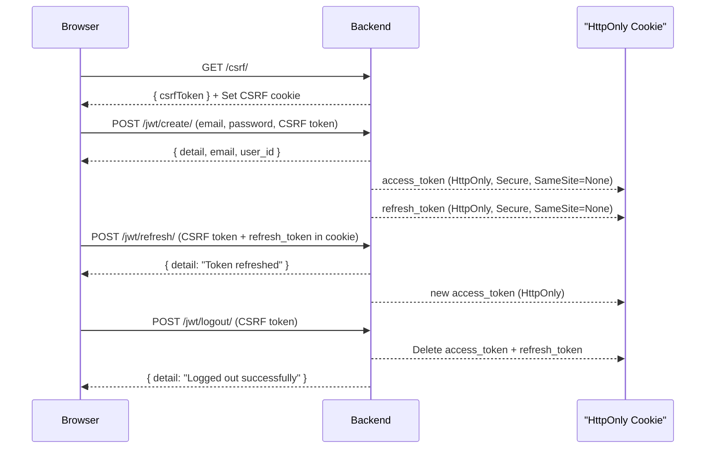

# Forum Project Stage CC WebAPI Documentation

This document describes the available endpoints, request formats, response structures, and validation rules for the *
*Forum Project Stage CC WebAPI**.  
It is organized by module to allow each developer to maintain and extend their respective sections.

---

## Authentication

All endpoints require JWT authentication.  
Include the token in the `Authorization` header using the following format:

Authorization: Bearer <your_access_token>

---

## Auth API

### Endpoints

#### 1. CSRF Init

- `GET /api/v1/auth/csrf/`
  Returns a CSRF token in JSON and sets the CSRF cookie.  
  This must be called by the frontend before sending any POST/PUT/PATCH/DELETE requests that require CSRF protection.

### Example Response

```json
{
  "csrfToken": "<csrf_token>"
}
```

#### 2. JWT Create (Login)

- `POST /api/v1/auth/jwt/create/`
  Authenticates a user and issues JWT tokens.
  - Sets both access_token and refresh_token in secure HttpOnly cookies.
  - Returns only minimal user info in response body (no tokens).

### Request Example

- POST /api/v1/auth/jwt/create/
    Headers:
    - Content-Type: application/json
    - X-CSRFToken: <csrf_token>

```json
{
  "email": "user@example.com",
  "password": "strong_password"
}
```

### Example Response

```json
{
  "detail": "Login successful",
  "email": "user@example.com",
  "user_id": 42
}
```
The access_token and refresh_token are stored in HttpOnly cookies and are not returned in the response body.

#### 3. JWT Refresh

- `POST /api/v1/auth/jwt/refresh/`
  Issues a new access token using the refresh token stored in the secure HttpOnly cookie.
  If the refresh token is invalid or expired, the cookie will be cleared.

### Request Example

- POST /api/v1/auth/jwt/refresh/
    Headers:    
    - Content-Type: application/json    
    - X-CSRFToken: <csrf_token>

### Example Response

```json
{
  "detail": "Token refreshed"
}
```
The new access token is available only in the HttpOnly cookie.

#### 4. JWT Logout

- `POST /api/v1/auth/logout/`
  Blacklists the refresh token (if blacklisting is enabled) and clears both access_token and refresh_token cookies.

### Request Example

- POST /api/v1/auth/logout/
    Headers:
    - Content-Type: application/json
    - X-CSRFToken: <csrf_token>

### Example Response

```json
{
  "detail": "Logged out successfully"
}
```

### Authentication Flow



## Startup API

### Endpoints

- `GET /api/profiles/startups/` — Retrieve a list of all startup profiles
- `POST /api/profiles/startups/` — Create a new startup profile
- `GET /api/profiles/startups/{id}/` — Retrieve details of a specific startup profile
- `PATCH /api/profiles/startups/{id}/` — Update an existing startup profile
- `DELETE /api/profiles/startups/{id}/` — Delete a startup profile

### Startup Notification Preferences

All endpoints require authentication and the Startup role. Base path: `/api/v1/startups/`.

- `GET /api/v1/startups/preferences/` — Get the current startup user's notification channel preferences. If preferences do not exist, defaults are created and per-type preferences are seeded for all active notification types.
- `PATCH /api/v1/startups/preferences/` — Update channel toggles (`enable_in_app`, `enable_email`, `enable_push`). Partial updates supported.
- `PATCH /api/v1/startups/preferences/update_type/` — Update the frequency for a specific notification type. Payload requires `notification_type_id` (int) and `frequency` (one of `immediate`, `daily_digest`, `weekly_summary`, `disabled`).

#### Example: GET /api/v1/startups/preferences/

Response 200

```json
{
  "user_id": 12,
  "enable_in_app": true,
  "enable_email": true,
  "enable_push": true,
  "type_preferences": [
    {
      "id": 101,
      "notification_type": { "id": 3, "code": "message_received", "name": "Message Received", "description": "A new message was received", "is_active": true },
      "frequency": "immediate",
      "created_at": "2025-08-05T12:00:00Z",
      "updated_at": "2025-08-05T12:00:00Z"
    }
  ],
  "created_at": "2025-08-05T12:00:00Z",
  "updated_at": "2025-08-05T12:00:00Z"
}
```

#### Example: PATCH /api/v1/startups/preferences/

Request

```json
{
  "enable_in_app": true,
  "enable_email": false,
  "enable_push": true
}
```

Response 200

```json
{
  "user_id": 12,
  "enable_in_app": true,
  "enable_email": false,
  "enable_push": true,
  "type_preferences": [ /* ... */ ]
}
```

#### Example: PATCH /api/v1/startups/preferences/update_type/

Request

```json
{
  "notification_type_id": 3,
  "frequency": "daily_digest"
}
```

Response 200

```json
{
  "id": 101,
  "notification_type": { "id": 3, "code": "message_received", "name": "Message Received", "description": "A new message was received", "is_active": true },
  "frequency": "daily_digest",
  "created_at": "2025-08-05T12:00:00Z",
  "updated_at": "2025-08-05T12:05:00Z"
}
```

Error responses

- 400 Missing fields

```json
{
  "notification_type_id": ["This field is required."],
  "frequency": ["This field is required."]
}
```

- 400 Invalid notification_type_id (non-integer)

```json
{
  "notification_type_id": ["A valid integer is required."]
}
```

- 400 Invalid frequency value

```json
{
  "frequency": ["\"invalid_freq\" is not a valid choice."]
}
```

- 404 Notification type preference not found

```json
{
  "error": "Notification type preference not found"
}
```

## Investor API

### Endpoints

- `GET /api/profiles/investors/` — Retrieve a list of all investors
- `POST /api/profiles/investors/` — Create a new investor  
  ...

### Request Example: Create Startup Profile

```json
{
  "company_name": "GreenTech",
  "description": "Eco-friendly solutions",
  "website": "https://greentech.ua",
  "startup_logo": null
}
```

### Response Example: Created Startup Profile (201 Created)

```json
{
  "id": 1,
  "company_name": "GreenTech",
  "description": "Eco-friendly solutions",
  "website": "https://greentech.ua",
  "startup_logo": null,
  "projects": [],
  "created_at": "2025-08-05T00:00:00Z",
  "updated_at": "2025-08-05T00:00:00Z"
}
```

---

## Project API

### Endpoints

- `GET /api/projects/` — Retrieve a list of all projects
- `POST /api/projects/` — Create a new project
- `GET /api/projects/{id}/` — Retrieve details of a specific project
- `PATCH /api/projects/{id}/` — Update an existing project
- `DELETE /api/projects/{id}/` — Delete a project

---

### Request Example: Create Project

```json
{
  "startup": 1,
  "title": "AI Platform",
  "description": "Smart analytics for business",
  "status": "draft",
  "duration": 30,
  "funding_goal": "100000.00",
  "current_funding": "5000.00",
  "category": 2,
  "email": "project@example.com",
  "has_patents": true,
  "is_participant": false,
  "is_active": true
}
```

### Response Example: Created Project (201 Created)

```json
{
  "id": 1,
  "startup": 1,
  "title": "AI Platform",
  "description": "Smart analytics for business",
  "status": "draft",
  "duration": 30,
  "funding_goal": "100000.00",
  "current_funding": "5000.00",
  "category": 2,
  "email": "project@example.com",
  "has_patents": true,
  "is_participant": false,
  "is_active": true,
  "created_at": "2025-08-05T00:00:00Z",
  "updated_at": "2025-08-05T00:00:00Z"
}
```

---

## Validation Rules

### Startup Profile

- company_name: required, unique
- description: required
- website: optional
- startup_logo: optional

### Project

- startup: required (must reference existing profile)
- title: required
- funding_goal: required if is_participant is true
- current_funding: must not exceed funding_goal
- business_plan: required if status is completed
- email: required, must be valid

---

## Token Refresh

Use `/api/token/refresh/` to obtain a new access token.

### Response Example

```json
{
  "refresh": "<your_refresh_token>",
  "access": "<your_new_access_token>"
}
```

# OAuth Authentication API Documentation

## Part 1

## Overview

This document describes the OAuth authentication endpoints for Google and GitHub integration.

---

## POST api/v1/auth/oauth/login/

### Description

Authenticate users using Google or GitHub OAuth providers. The endpoint exchanges OAuth provider tokens for application
JWT tokens and returns user information.

## Request

- **Headers:**  
  `Content-Type: application/json`

- **Body:**
  ```json
  {
    "provider": "google" | "github",
    "token": "<OAuth token>"
  }
  ```
    - **Response**
  ```json
  {
    "access": "jwt_access_token",
    "user": {
      "id": "user_123",
      "email": "user@example.com",
      "first_name": "John",
      "last_name": "Doe",
      "user_phone": "",
      "title": "",
      "role": "user"
    }
  }
  ```

**Status codes:**

|    Status Code    |                 Description                  |
|-------------------|----------------------------------------------|
| `400 Bad Request` | Invalid request parameters or malformed data |
| `403 Forbidden`   | Authenticated but insufficient permissions   |

## Part 2

## Callback URLs

The OAuth callback URLs are configured to handle redirects after successful authentication with the OAuth provider.
These URLs are used by the frontend to receive authorization codes or tokens.

### Configured Callback URLs

- **Production**: ----
- **Development**: `http://127.0.0.1:8000/oauth/callback/`

## Usage Instructions

1. **Initiate OAuth Flow**:
    - Redirect users to the OAuth provider's authorization endpoint (e.g., `https://provider.com/oauth/authorize`).
    - Include the appropriate `redirect_uri` parameter matching one of the configured callback URLs

2. **Handle Callback**:
    - After authentication, the OAuth provider will redirect the user to the specified callback URL with an
      authorization code or token in the query parameters (e.g., `https://yourapp.com/auth/callback?code=abc123`).
    - The frontend should extract the `code` from the URL query parameters using `URLSearchParams`.

3. **Extracting Query Parameters**:
    - Example of JavaScript to extract parameters from the callback URL:
      ```javascript
      const urlParams = new URLSearchParams(window.location.search);
      const code = urlParams.get('code');
      const state = urlParams.get('state');
      const error = urlParams.get('error');
      ```

4. **ExchangeCode for Token**:
   -Send the authorization code to your backend API `/users/oauth/login/` to exchange it for an access token.

## Notifications API (Communications)

All endpoints require authentication and are available under the base path: `/api/v1/communications/`.

### Endpoints

- `GET /notifications/` — List current user's notifications.
- `GET /notifications/unread_count/` — Get unread notifications count.
- `POST /notifications/{notification_id}/mark_as_read/` — Mark notification as read.
- `POST /notifications/{notification_id}/mark_as_unread/` — Mark notification as unread.
- `POST /notifications/mark_all_as_read/` — Mark all notifications as read.
- `POST /notifications/mark_all_as_unread/` — Mark all notifications as unread.
- `GET /notifications/{notification_id}/resolve/` — Get only redirect payload for a notification.
- `DELETE /notifications/{notification_id}/` — Delete a notification.

Creation of notifications via public API is disabled.

### Query Parameters (GET /notifications/)

- `is_read` — true | false (filter by read state: true = read, false = unread)
- `type` — notification type code (slug)
- `priority` — low | medium | high
- `created_after` — ISO datetime (e.g., 2025-08-05T00:00:00Z)
- `created_before` — ISO datetime

### Response Example (GET /notifications/)

```json
{
  "count": 1,
  "next": null,
  "previous": null,
  "results": [
    {
      "notification_id": "b6b9e6f4-8f5a-4e58-9e7f-2d3b1f7ac111",
      "notification_type": {
        "id": 3,
        "code": "message_received",
        "name": "Message Received",
        "description": "A new message was received",
        "is_active": true
      },
      "title": "You have a new message",
      "message": "Investor John Doe sent you a message",
      "is_read": false,
      "priority": "medium",
      "priority_display": "Medium",
      "actor": {
        "type": "investor",
        "user_id": 42,
        "investor_id": 7,
        "display_name": "Acme Ventures"
      },
      "redirect": {
        "kind": "message",
        "id": 99,
        "url": "/messages/99"
      },
      "created_at": "2025-08-05T12:34:56Z",
      "updated_at": "2025-08-05T12:34:56Z",
      "expires_at": null
    }
  ]
}
```

### Actions Responses

- `POST /notifications/{id}/mark_as_read/` → `{ "status": "notification marked as read" }`
- `POST /notifications/{id}/mark_as_unread/` → `{ "status": "notification marked as unread" }`
- `POST /notifications/mark_all_as_read/` → `{ "status": "marked <n> notifications as read" }`
- `POST /notifications/mark_all_as_unread/` → `{ "status": "marked <n> notifications as unread" }`
- `GET /notifications/{id}/resolve/` → `{ "redirect": { ... } }`

# Company Binding API

## Overview

The Company Binding API allows authenticated users to associate themselves with a company (startup or investor) after
registration. Users can either bind to an existing company or create a new one.

## Endpoint

**POST** `/api/v1/auth/bind-company/`

## Authentication

- Requires authentication via JWT stored in an **HttpOnly cookie** named `access_token`.
- No `Authorization` header is needed; the backend reads the token from the cookie.

## Request Body

```json
{
  "company_name": "Tech Innovations Inc.",
  "company_type": "startup"
}
```

## Example Response

```json 
{
  "message": "Successfully bound to existing startup: Tech Innovations Inc.",
  "company_type": "startup",
  "company_id": 1
}
```